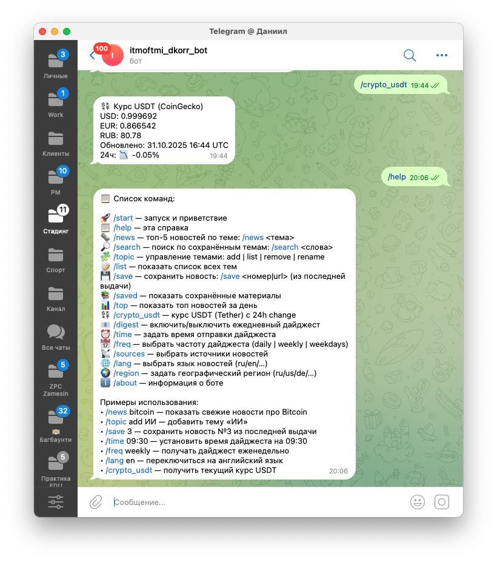
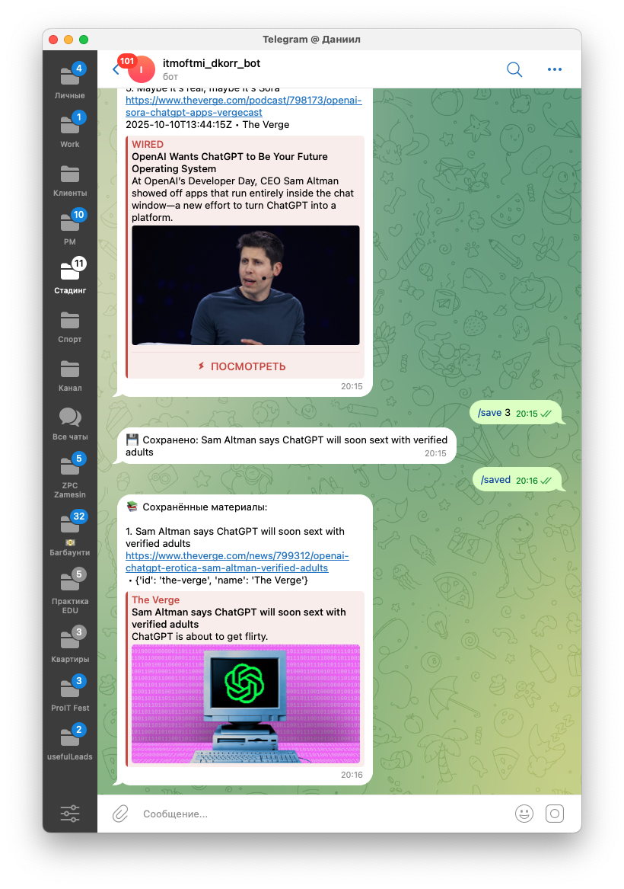

University: [ITMO University](https://itmo.ru/ru/)
Faculty: [FTMI](https://ftmi.itmo.ru/)
Course: [Vibe Coding: AI-боты для бизнеса](https://github.com/itmo-ict-faculty/vibe-coding-for-business)
Year: 2025/2026
Group: U4225
Author: Korinenko Daniil Trofimovich
Lab: Lab1-2
Date of create: 24.10.2025
Date of finished: \\

## Лабораторная №1

### Бот-агрегатор информации

- Собирает новости по определенным темам
- Отправляет ежедневные дайджесты
- Фильтрует информацию по ключевым словам
- Сохраняет интересные материалы

Помогает собирать актуальную информацию в новостных источниках по интересуемым темам. Выбрал, чтобы быстро получать новости, чтобы принимать решения о покупке/продажи на биржевом рынке.

### Промпт для LLM

Создай Telegram-бота на Python с использованием библиотеки python-telegram-bot.

**Функционал бота:**

* Бот-агрегатор новостей, который собирает новости из RSS-лент, NewsAPI, Mediastack и других источников
* Пользователь может добавлять темы (ключевые слова) и настраивать предпочтения (источники, язык, регион)
* Бот отправляет регулярные дайджесты (ежедневно, еженедельно, по будням) в заданное время
* Пользователь может в любой момент запросить топ новостей, выполнить поиск по темам, сохранить новость для последующего чтения
* Дополнительно: команда для получения текущего курса USDT (Tether) через CoinGecko API

**Команды бота:**

* `/start` - приветствие и краткое описание
* `/help` - список команд с описанием
* `/about` - информация о боте и разработчике
* `/topic` - управление темами (добавить, удалить, переименовать, список)
* `/top` - топ новостей за день (до 10)
* `/digest` - включить/выключить дайджест
* `/time` - установить время дайджеста (формат ЧЧ:ММ)
* `/freq` - установить частоту (daily, weekly, weekdays)
* `/sources` - выбор источников (rss, api, telegram, reddit)
* `/lang` - выбор языка (ru, en, de, fr, es)
* `/region` - выбор региона (ru, us, de, fr, gb, ua)
* `/list` - список тем
* `/rename` - переименовать тему
* `/crypto_usdt` - курс USDT
* `/news` - поиск новостей через NewsAPI по запросу и опциональному региону
* `/search` - поиск новостей по сохраненным темам
* `/saved` - показать сохраненные новости
* `/save` - сохранить новость (по номеру из последней выдачи или по URL)

**Требования:**

* Бот должен быть написан на Python с использованием асинхронной библиотеки python-telegram-bot
* Использовать JSON файл для хранения данных пользователей (настройки, темы, сохраненные новости)
* Реализовать модульную структуру: отдельные файлы для работы с новостями и планировщиком
* Должен логировать информацию, выводить информацию об ошибках
* Добавить обработку ошибок и таймаутов для сетевых запросов
* Использовать .env файл для конфигурации (токены API и т.д.)
* Настроить логирование для отслеживания работы бота

**Создай:**

1. **Файл bot.py** с кодом бота, включая:

   * Класс NewsAggregatorBot с методами для команд и обработчиков
   * Загрузку и сохранение данных пользователей
   * Обработчики команд и callback-запросов от инлайн-кнопок
   * Методы для безопасной отправки сообщений (с повторами при таймаутах)
2. **Файл requirements.txt** с зависимостями:
3. **Файл README.md** с инструкцией по запуску
4. **Файл .env.example** для примера конфигурации

Код должен быть хорошо прокомментирован, особенно сложные части связанные с асинхронностью и работой с внешними API.

#### Дополнительные итерации

Пришлось сделать около 20 дополнительных итераций для того, чтобы исправить местные появляющиеся ошибки. Также пришлось сменить агента из Cursor на ChatGPT 5, потому что в Cursor закончились токены.

### Шаги решения

1. Зарегистрировал бота
   
2. Внешний вид созданного проекта: 
3. Запуск бота с логами: 

4. Команда `/help`
   
5. Добавление темы
   
6. Команда `/top` — топ новостей за день
   
7. Собирает новости по темам с командой `/news` (использует NewsAPI)
   
8. Сохранение новостей и их просмотр с командами `/save` и `/saved`:
   
9. Поиск по сохраненным темам с `/search`
   
10. Получение курса криптовалют с командой `/crypto_usdt`
    

### Трудности и решения

Главная проблема связана с тем, что бот использует не новые методы и библиотеки. Чтобы решить, приходилось гуглить документацию и обновлять промпт с ссылкой на актуальные доки. Кроме того часто приходилось смотреть и подсвечивать очевидные ошибки, которые возникали

### Выводы

#### Хорошо

- Агент берет на себя самую большую часть работы, пишет сервисные файлы и дает базу, с которой можно работать
- Не приходится разбираться с документацией, бот пишет все сам

#### Плохо

- Могут возникать очевидные ошибки, которые агент не видит, пока не намекнуть
- Если агенту "нравится" определенное решение, он идет в него до конца и не ищет другие варианты

#### Чему научился

- Честно говоря, из нового узнал только про CoinGecko и NewsAPI как ресурсы
