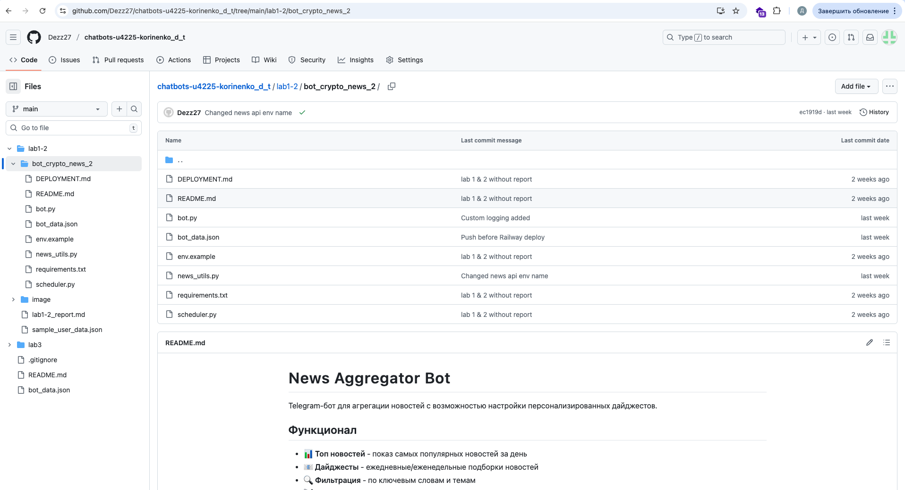
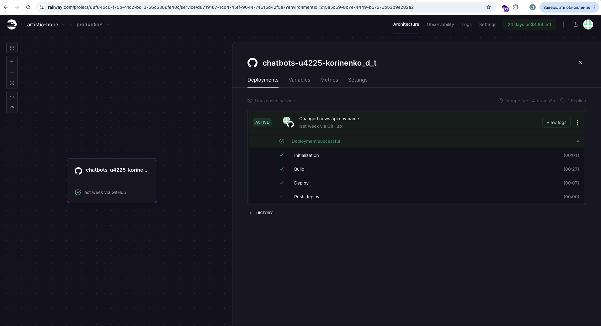
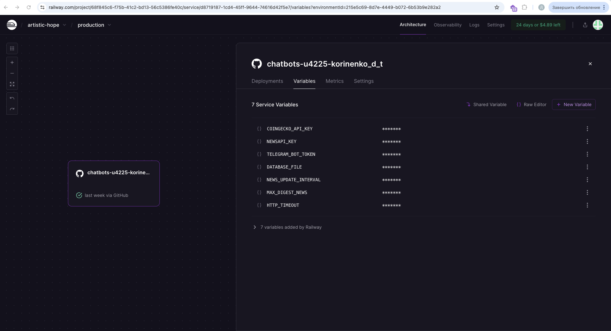
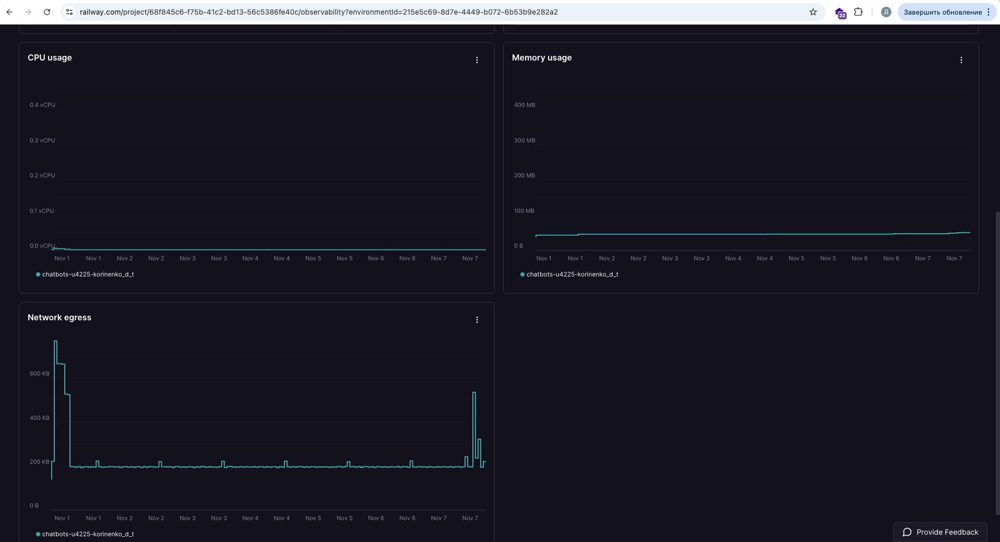
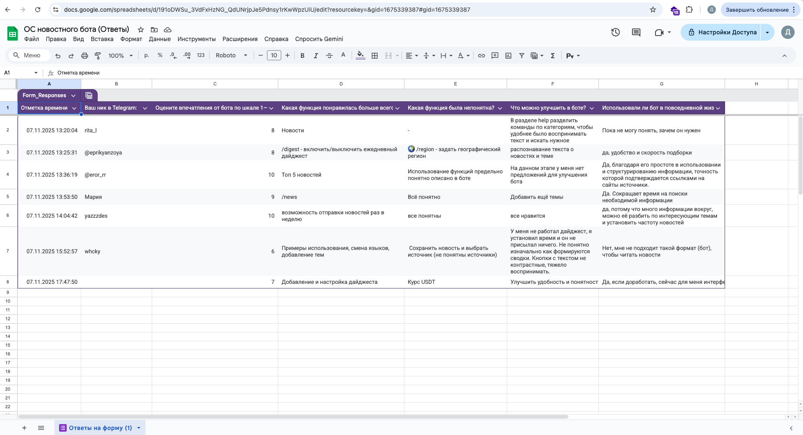
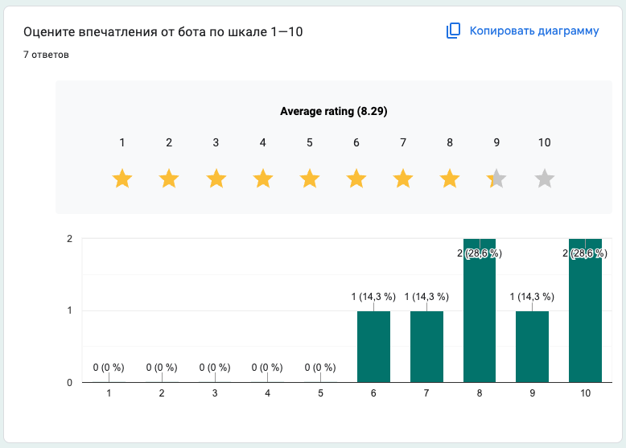
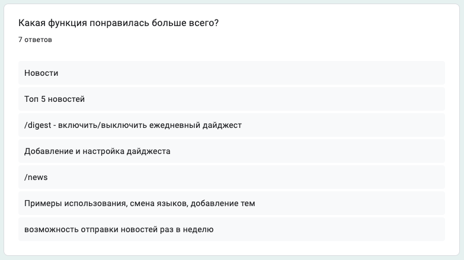
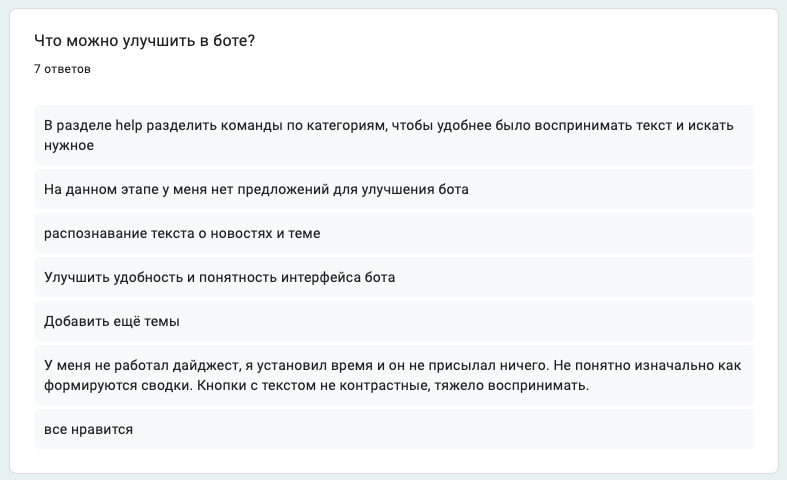
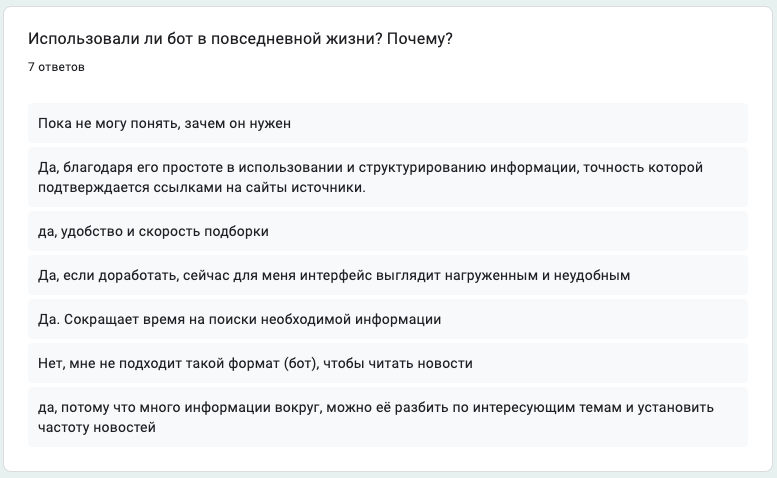
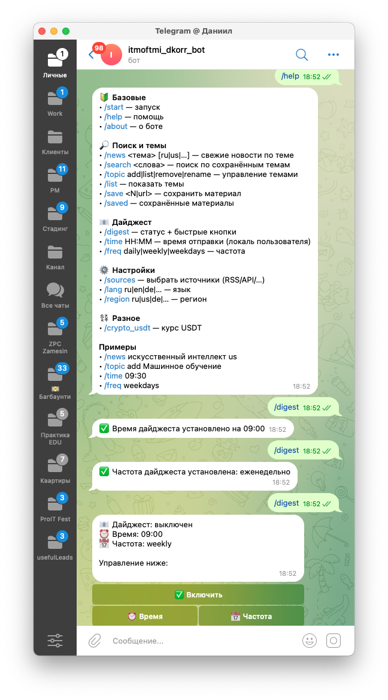

University: [ITMO University](https://itmo.ru/ru/)
Faculty: [FTMI](https://ftmi.itmo.ru/)
Course: [Vibe Coding: AI-боты для бизнеса](https://github.com/itmo-ict-faculty/vibe-coding-for-business)
Year: 2025/2026
Group: U4225
Author: Korinenko Daniil Trofimovich
Lab: Lab 3
Date of create: 31.10.2025
Date of finished: \\

### Описание деплоя

Использовал Railway, как самый быстрый способ, который к тому же предаставляет возможность снимать метрики. К тому же деплой ложится на Railway, не приходится поднимать свой VPS, как в случае с докером и не нужно держать включенным собственное устройство. Адрес бота: [https://t.me/itmoftmi_dkorr_bot](https://t.me/itmoftmi_dkorr_bot)

### Процесс деплоя

Проблем не было, только не сразу понял, что нужно указать папку, откуда должен происходить деплой

1. Деплой происходил из папки по адресу 
2. Общий вид 
3. Добавили переменные окружения 
4. Дашборды 

### Сбор фидбека

1. Таблица с обратной связью (7 пользователей)
2. Общие впечатления

   
3. Непонятная функция
   
4. Предложения по улучшению
   
5. Обратная связь по использованию бота:
   

### Улучшения после обратной связи

Добавили разграничение тем в `/help` и кнопки в настройке дайджеста 

### Выводы

1. Railway — отличный инструмент для деплоя
2. NLP — тяжелый инструмент, хотел бы его добавить, чтобы по-настоящему находить новости по темам.
